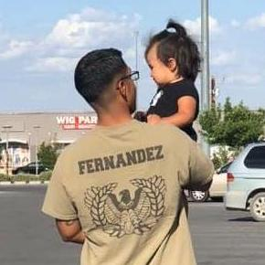

# Introduction

Hello world! My name is Victor Fernandez III. These are notes I have developed to help you prepare for the CompTIA Security+ certification. They also represent what I believe should be the baseline body of knowledge for junior cybersecurity professionals. Based on my experience in the field, I strongly recommend investing time learning Information Technology \(IT\) and networking fundamentals before diving into cybersecurity. If this recommendation speaks to you, I have another [digital notebook](https://itfplus.cyberphor.com) for the CompTIA IT Fundamentals certification. 

