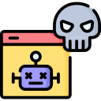

# Services & Applications

Attacks against services and applications seek to disrupt/manipulate client-server communications. They occur between systems, within systems, and against the web. As a cybersecurity professional, you must be able to recognize them and reduce their impact.

## Between Systems

### Denial of Service

A Denial-of-Service \(DoS\) is when an attacker prevents a resource from being available. One example of a DoS attack is flooding a server with network traffic, overwhelming it's memory and/or computing capabilities. Another more low-tech example is spilling coffee on it. By causing the server to short-circuit, the attacker has caused a DoS. 

### Distributed Denial-of-Service 

The difference between a DoS and Distributed DoS \(DDoS\) attack are the number of attackers. A DDoS is when multiple attackers are preventing a resource from being available. The most common DDoS scenario is when a _botnet_ is able to take a website offline.  

### Man-in-the-Middle

A Man-in-the-Middle \(MiTM\) attack is when someone is able to position themselves between two computers on the network to conduct surveillance and/or manipulate data. In the physical world, this may look like an attacker intercepting mail and changing the source address \(imagine if it was a love-letter from you to someone you admire\). Examples in cyberspace would be ARP and DNS Poisoning. 

#### ARP Poisoning

The Address Resolution Protocol \(ARP\) is used to query the network for unknown MAC addresses. Computers need to know this kind of information in order to perform encapsulation and send data across the network. Once a query is answered, the response is cached in a look-up table. Attackers will often attempt to poison or add bogus entries to this look-up table in order to trick the victim into sending data to the wrong destination.  


Encapsulation is when computers add networking information to data before transmitting it. De-encapsulation is when computers remove the same networking information to access the data transmitted. 


#### DNS Poisoning

The Domain Name System \(DNS\) is a service that allows you to use easy-to-remember computer/website names instead of IP addresses \(like a phone-book\). DNS Poisoning is when an attacker gets a computer to use the wrong IP address for a specific domain name. For example, I use `54.156.193.108` to stream and watch content from `www.netflix.com`. If someone was able to swap out `54.156.193.108` with `146.185.170.222,` any time I try to access `www.netflix.com` my computer would be communicating with a well-known malware command & control server.  

### Spoofing

#### MAC Spoofing

MAC Spoofing is when an attacker is able to clone your MAC address and impersonate you on the network. They may want to do this in order to bypass network security controls like MAC address filtering and port security. 

#### IP Spoofing

IP Spoofing is similar to MAC Spoofing albeit it involves IP addresses. By spoofing an IP address, an attacker can bypass firewall rules and make attribution of their activity difficult. Although, changing one's IP address is not always malicious. Everyday people will use Virtual Private Networks \(VPNs\) to change their IP address in order to access restricted Internet content. 

## Within Systems

### Pass-the-Hash

Pass-the-Hash \(PTH\) is when an attacker uses the hash of a victim's password instead of the actual credential to login. By doing so, the attacker eliminates the need to guess the plain-text version. An attacker will be able to learn a victim's password hash if it unencrypted and stored or sent across the network.

### Buffer Overflow

A Buffer Overflow is when an attacker provides more data than what a program was expecting. For example, imagine a program that creates a buffer in memory 10 characters in size. Said buffer is designed to save the letters of your first name. If you provide a name that's 11 characters long, the program will crash. This is a Buffer Overflow. Buffer Overflows are often used for Privilege Escalation.

### Privilege Escalation

Privilege Escalation is when an attacker uses low-level access to a system to gain high-level access. One way of doing this is by invoking programs that run with administrator privileges and hijacking them in memory.

### Shimming

Shimming is when attackers use drivers to exploit software compatibility issues. The word "shim" means to fill a gap, put something in-between, or level something off-balance. Loading additional drivers is often the fix when a program is unable to run. One method of mitigating shimming attacks is ensure your drivers are digitally-signed by a vendor you trust.

### Refactoring

Attackers will routinely refactor the malware they develop to evade detection. Factoring is a technique used to represent a complex solution to a problem in small parts. Take a car as a metaphor. Cars solve the problem of getting from one place to another. Refactoring a car may involve moving the front wheels to the back and vice versa. In the end, the car still gets you to your destination albeit it's a different design. The same goes for malware. An attacker may redesign their malware to make it unrecognizable to anti-virus programs.

## Against the Web

### Domain Squatting

Domain Squatting is when an attacker registers a domain name of a topic that is expected to garner a lot of attention. To explain, say there's a rumor that Angelina Jolie will run for president in 2024. Someone may then buy `www.angelina4president2024.com` expecting to get a hefty return-on-investment in the future.

### Domain Hijacking

Domain Hijacking is when attacker takes control of an existing domain name from from the original registrant. This can happen via Social Engineering or complacency. For example, if you allow your domain name registration to expire, someone could purchase it and hold it for ransom \(how much are you willing to pay for your online reputation?\).

### Typo-Squatting

Typo-Squatting \(a.k.a "URL Hijacking"\) is when the attacker purchases and leverages the misspelled version of a popular domain name. For instance, people often misspell Google as Gogle, Goggle, and Gooogle. Any one of these names would be perfect for an attacker seeking to phish or exploit.

### Click-Jacking

Click-Jacking is when the attacker gets a user to click on something that appears benign but is actually malicious. A button on a website might say "Click here for free beer!" Unbeknownst to the user, the button links to a server hosting malware.

### Man-in-the-Browser

Man-in-the-Browser attacks are when an an attacker uses web browser extensions to achieve their objectives. For instance, take those popular add-ons that promise to save you money while you shop online. They could also be used to conduct surveillance on you and even allow someone remote access to your computer. 

### Cross-Site Scripting

Cross-Site Scripting \(XSS\) is when an attacker stages and launches an attack from a website that accepts input. The attack is not against the server hosting the website, it is against anyone who visits the website. These kind of attacks are described as _client-side attacks_ as opposed to _server-side attacks_. Prime candidates for XSS attacks are social media platforms like blogs and message boards. These attacks work because of the way web browsers render HTML \(Hypertext Markup Language\) files and JavaScript code.

Websites with static information are written in HTML and consist of elements like `<h1>` and `</h1>` tags. Think of static information like restaurant menus, phone numbers, and the names of business owners. If someone wanted to display dynamic content, they would add JavaScript to their HTML code. Dynamic content might be weather notifications, online puzzles, etc. HTML organizes JavaScript code using `` tags. Although, the browser doesn't care what kind of data is served. It will render anything it recognizes.

Other conditions that allow XSS attacks to happen are when websites fail to validate input \(block special characters like those found in `</script>` tags\). I mentioned blogs before, let's use those as an example. Blog owners may wish to accept input so readers can comment and provide feedback. Yet, what if instead of sharing praise an attacker typed malicious code written in a language like JavaScript? Anyone visiting the blog would then fall prey to the perpetrator's XSS attack. As a security professional, you must be cognizant of possible avenues of approach an attacker may take, especially public-facing ones like the web.

### Cross-Site Request Forgery

Cross-Site Request Forgery \(CSRF\) is when an attacker executes actions on a user's behalf against a website the user is currently authenticated with. To explain, imagine yourself online looking at your bank's website in one browser tab and skimming through social media in another. Someone sends you an link \(via social media\) and you click-on it. After checking it out, you look glance back at your bank only to realize it has a completely difference balance than before. You have now become a victim of the CSRF attack. This was possible because the attacker was able to access and reuse the cookies your bank gave you.

#### What are Cookies?

Cookies are given to users by web servers that need to remember them. They can be used by the web server to track the user's preferences, activity, or that they have properly authenticated. If you have ever put something into an online shopping cart, left the website, returned, and the item was still in your cart, you were given a cookie. Cookies are either persistent or not persistent. Persistent cookies are text-files that get added temporarily added to your computer's file system. Non-persistent cookies could be the same data albeit they are maintained in your computer's memory instead. The type of cookie you get depends on the web server.

### Session Hijacking

Session Hijacking is when the attacker discovers the identifier \(ID\) of a user's web session, spoofs them, and assumes control of their session. To explain, a web server will track your session with it by ID. If someone is able to learn what your ID is, they can spoof or impersonate your session with the web server.

### SQL Injection

SQL Injection is when an attacker sends Structured Query Language \(SQL\) commands as input to a website. SQL is a language for programming databases. Most web applications consist of a database, or back-end, and front-end \(what you in your browser\). If an attacker is clever enough, they can manipulate and retrieve sensitive information like usernames and passwords from the back-end through the front-end. For example, consider authenticating to a web application with the username `victor` and password `password123`. The front-end will display two input fields, while the back-end processes the data supplied using the SQL command below.


A single database will have multiple tables that resemble Microsoft Excel spreadsheets \(they all have rows and columns\). 


`"SELECT * FROM users WHERE username = '$UserName' AND password = '$PassWord'";` 

In layman's terms, this command is saying, "Please select/return the row of data from the `users` data table where the `username` and `password` columns are equal to what is provided." In other words, if I provided `victor` and `peanutbutter` as my username and password, the back-end database would be presented with the SQL command sentence below.

`"SELECT * FROM user WHERE username = 'victor' AND password = 'peanutbutter'";`

Now, imagine if instead of `peanutbutter`, I supplied `peanutbutter' OR 1=1` as my password. The back-end database would then see this...

`"SELECT * FROM user WHERE username = 'victor' AND password = 'peanutbutter'' OR 1=1";`

The command would then be saying, "Please select/return the row of data from the users data table where the username is `victor` and the password is `peanutbutter` or where `1=1`." In response, the back-end database will disclose everything from the users data table. This is because `1=1` is always true and the database will return data where the provided SQL command equates to true. As a cybersecurity professional, be aware of SQL Injections and ensure to impress upon your developers to use Input Validation, Parameterized Queries, and Stored Procedures when designing web applications. 



Input Validation scrubs the data supplied by users for bad characters or symbols. Examples of bad symbols are quotes and the equal sign. A user should hardly ever be allowed to provide these as input to a web application.  



Parameterized Queries is a fancy way of describing how database developers should separate code and data in the front-end of a web application. 



Stored Procedures are the same thing as Parameterized Queries albeit they are stored within the database or back-end instead of the front-end. 



