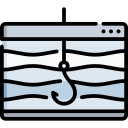

# Social Engineering

Social Engineering attacks target the vulnerability of people. It's human nature to be complacent, sympathetic, and/or trust the kindness of strangers. As a security professional, you must understand how bad guys take advantage of good people to achieve their objectives. Attackers often use Social Engineering to collect intelligence, gain access, or install malicious software. You should also know how to mitigate these attacks through cybersecurity awareness programs. If you want to change someone's behavior, increase their awareness. 

## Principles

Social Engineering attacks are successful because they use the following principles to take advantage of people: authority, intimidation, consensus, scarcity, familiarity, trust, and urgency. Below are examples for each. 

#### Authority

Calling someone for their password while impersonating an IT helpdesk clerk. 

#### Intimidation

Frightening someone into connecting a USB device to their computer.  

#### Consensus

Exchanging tickets to a football game for administrator privileges. 

#### Scarcity

Emailing someone a link and the promise of limited access to a vaccine if they click on it. 

#### Familiarity

Using common interests and kindness to collect intelligence from an employee about their organization. 

#### Trust

Leveraging an existing relationship to get someone to download unauthorized software. 

#### Urgency

Gaining physical access to a building after asking for directions to the bathroom. 

## Impersonation

### Phishing

#### Spear Phishing

#### Whaling

#### Vishing

## Proximity-based Attacks

### Tailgating

### Shoulder Surfing

## Community-based Attacks

### Hoaxes

### Watering Holes

### Dumpster Diving

### 

